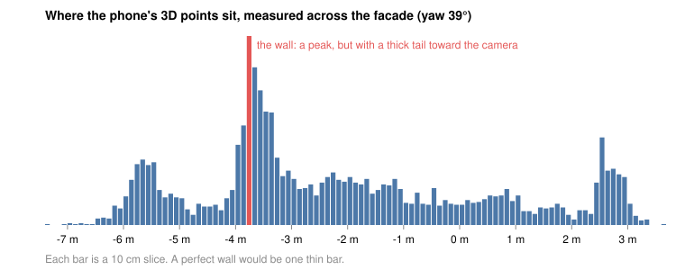
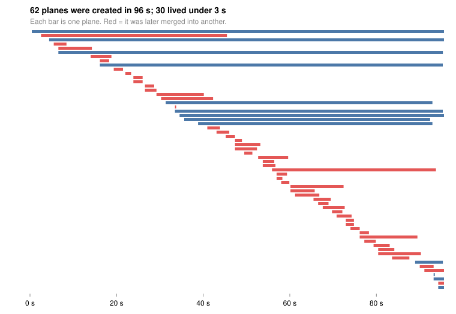

# Why we are moving from real-time RANSAC to SfM

## Context

The goal of the Siding Scanner is a siding takeoff (net wall area, corners and openings) from a few minutes of phone capture, with a stated margin of error of about ±5 %. Until now the plan was to find the walls by fitting planes in real time (RANSAC) to the 3D points the phone's camera tracks, taking the phone's own position tracking as given. On 2026-10-02 we ran that approach for the first time in the field, and this page explains what we tested, what came out, and why it changes our direction.

## What we tested

We ran our own real-time plane finder live on an iPhone 13 (no LiDAR), with the timing of every update recorded. The recording is 96 seconds of walking sideways along one facade, 4 to 7.5 m away. The settings were the ones shipped in the app, untouched. We looked at two things: whether it is fast enough to run on the phone, and whether the planes it produces are stable and well placed.

## Results

On speed, the answer is clearly yes. An update takes a median of 6 ms, 95 % of updates take under 13 ms, and the slowest took 20 ms, with one update every 250 ms. That is about 2 % of one processor core, and no update was skipped.

On quality, the answer is no:

- **Instability:** 62 planes were created for what is really 3 or 4 surfaces. 30 of them lived under 3 s, and 48 were merged back into the main ones.
- **Wobbly direction:** the same facade was fitted at angles from 37° to 50°, while one global scan of all the points gives 39°.
- **Thick points:** along the facade, the 3D points form a peak with a tail about 90 cm wide toward the camera, so each wall is a 30 to 60 cm thick fog of points rather than a thin sheet.

<!-- 
 -->

The first figure shows the fog: a perfect wall would be one thin bar. The second shows the churn: each bar is a plane, and the staircase of short red bars is the same wall being found and merged again and again.

## What this means

The plane finder is doing its job, but it is being asked to place a thin plane inside a thick fog, and no fitting method can do that to a few centimetres. This matters because wall area grows with the square of the distance to the wall: an error *e* at range *d* costs about 2·*e*/*d* of area. At 6 m, a ±20 cm error already costs about 7 %, against our ±5 % target, and the fog in this recording is wider than that. Speed was never the issue, so a faster or smarter RANSAC on the same points would not fix it. The limit is the input.

## Decision: move to SfM

We therefore stop tuning RANSAC on the phone's live points and move to SfM (Structure from Motion), which rebuilds the 3D scene from the photographs instead. Every recording already holds 4032×3024 photos, each with the phone's position, and we keep taking that position as given (so this is not SLAM). Seeing the same wall corner from two photos 3 m apart, 8 m away, should place it to about 1 cm per pixel of matching error. That is a back-of-envelope estimate: the phone's position drift will be the real limit, and the first test measures it. RANSAC stays as a small step on this cleaner data, and the live cloud stays as a rough guide.

The next steps, each with a pass check:

| Step | Pass if |
|---|---|
| **1. Measure one real facade with a tape.** We have never done this, so we have no accuracy number yet. | numbers written down |
| **2. Run SfM (COLMAP) on that face recording's photos.** | error under about 1 px, and wall thickness at most about 8 cm at 5–8 m (today: 30–60 cm) |
| **3. Project wall and opening outlines from the photos onto the wall.** | area within ±5 % of the tape |

## The proposed solution and timeline

The product becomes a two-part system. **On the phone**, the app guides a short walk around the house and records what it sees: the photos, the phone's position for each one, and the 3D points it tracks. It also checks while recording that the capture is good enough (enough sideways movement, every wall covered). **In the cloud (AWS)**, the recording is uploaded and a pipeline rebuilds the scene from the photos with SfM, fits the walls, outlines the openings, and returns the takeoff with a stated margin of error. The phone stays light and cool, and the heavy computation runs on GPU machines that we can improve without shipping a new app.

We estimate **about 3 months to a first working solution**: the phone capture, the cloud pipeline end to end, and the takeoff on real houses. We then plan **at least 3 more months of refinement**, mostly on the user experience (capture guidance, review of results) and on making the cloud pipeline robust and fast. The first weeks are cheap checks (steps 1 and 2 above), so we will know early whether the approach holds before most of the investment is made.
